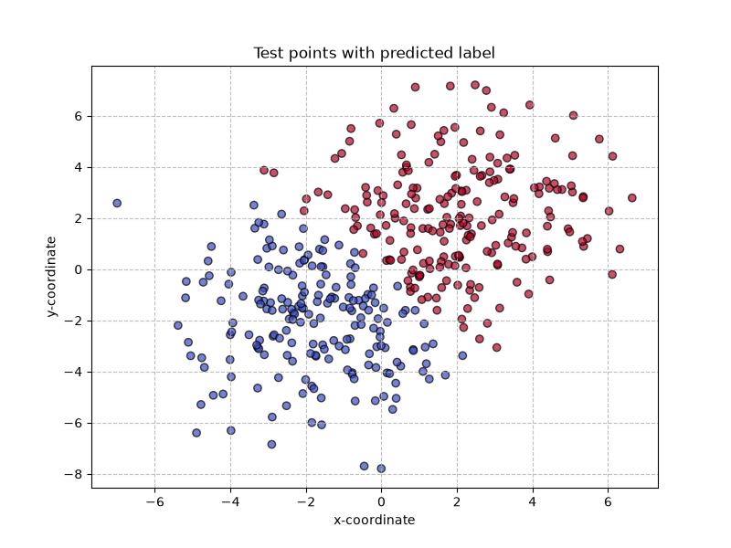
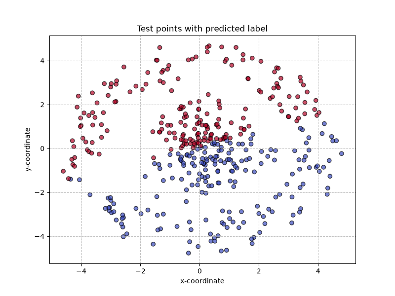
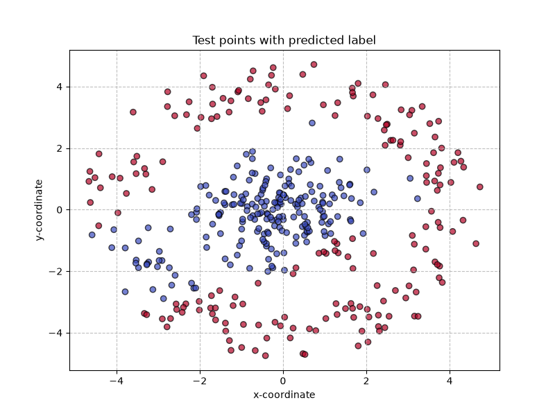
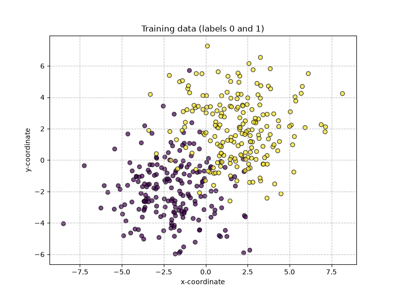
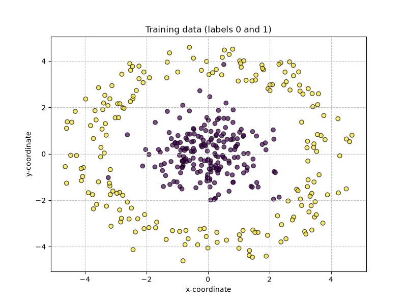

# Binary classifier from scratch (numpy only)

A 2D binary classification project that compares **logistic regression** and a **1-hidden-layer neural network**.

**Takeaway:** logistic regression achieves ≈90% accuracy on linearly separable data but fails on a ring-shaped dataset (≈52%); a small neural network recovers ≈90% accuracy by learning a non-linear decision boundary.

## Results

| Model | Dataset | Train acc. | Test acc. | Decision boundary |
|-------|---------|------------|-----------|-------------------|
| Logistic regression | Linear (d1) | ≈0.92 | ≈0.91 | linear |
| Logistic regression | Non-linear (d2) | ≈0.52 | ≈0.52 | linear (fails) |
| Neural network (8 hidden, tanh) | Non-linear (d2) | ≈0.93 | ≈0.90 | non-linear |

*Accuracies with SEED=42, LR=0.1, EPOCHS=300 (see src/config.py).*

### Linear data — logistic regression works



### Non-linear data — logistic regression fails



### Non-linear data — neural network succeeds



## Quick start

**Requirements:** Python 3.10+

```bash
git clone https://github.com/bbblue2004/mini-neural-network-from-scratch.git
cd mini-neural-network-from-scratch
python -m venv .venv
.venv\Scripts\activate        # Windows
pip install -r requirements.txt
python main.py
```

`main.py` runs three experiments in order:

1. Logistic regression on linear data (`images/log_reg/`)
2. Logistic regression on non-linear data (`images/log_reg_nonlin/`)
3. Neural network on non-linear data (`images/nn/`)

Metrics are printed in the terminal; plots are saved in each experiment subfolder under images/.

## What this project covers

- Forward pass and backpropagation implemented from scratch (vectorized with NumPy)
- Binary cross-entropy loss with numerical clipping
- He-style initialization for hidden-layer weights
- Synthetic 2D datasets for linear vs non-linear classification
- Training loss curves and prediction scatter plots

## Datasets

Two datasets with 200 points per class (`N_PER_CLASS` in `src/config.py`).

### d1 — linearly separable (two Gaussian distributions)

- Class 0: Gaussian centered at (-2, -2), σ = 2
- Class 1: Gaussian centered at (2, 2), σ = 2



### d2 — non-linearly separable (disk vs ring)

- Class 0: Gaussian centered at (0, 0), σ = 1
- Class 1: points at radius r ∈ [3.2, 4.8] with uniform random angle



Test sets are fresh samples drawn from the same distributions.

## Models

### Logistic regression

- Score: z = w · x + b
- Prediction: ŷ = σ(z)
- Loss: binary cross-entropy
- Init: w = (0, 0), b = 0

### Neural network

**Architecture:** Input (2) → Hidden (8, tanh) → Output (1, sigmoid)

- Init: random weights (and not zero, otherwise the model cannot learn), zero bias
- Training: full-batch gradient descent with hand-written backprop
- Loss: binary cross-entropy

## Configuration

| Parameter | Default | Location |
|-----------|---------|----------|
| SEED | 42 | `src/config.py` |
| LR | 0.1 | `src/config.py` |
| EPOCHS | 300 | `src/config.py` |
| Hidden size | 8 | `main.py` |

## Project structure

```
main.py                  # runs all three experiments
src/
  config.py              # hyperparameters and paths
  data.py                # dataset generators
  models/
    logistic_regression.py
    neural_network.py
  utils/
    utils.py             
    visualization.py     # plot functions
images/
  log_reg/               # experiment 1 outputs
  log_reg_nonlin/        # experiment 2 outputs
  nn/                    # experiment 3 outputs
```
